# 1. Описание функциональности монолитного приложения (AS-IS)

## 1.1. Контекст монолитного приложения Кинобездна
> **Важно**: диаграмма строится на основе описания текущего решения компании.  

Диаграмма контекста текущей системы Кинобездна:

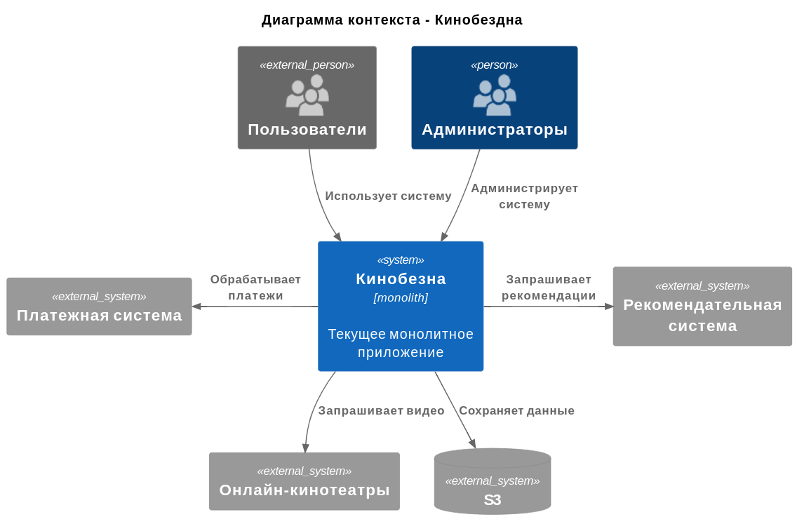

## 1.2 Контейнеры монолитного приложения Кинобездна

> **Важно**: диаграмма строится на основе описания текущего решения компании.  

Диаграмма контейнеров текущей системы Кинобездна:

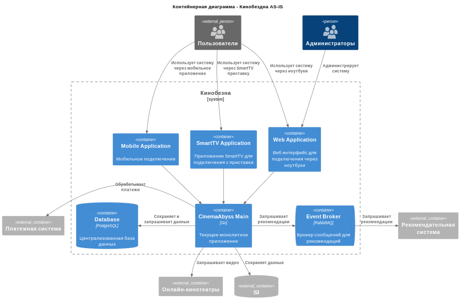

## 1.3. Компоненты монолитного приложения Кинобездна

> **Важно**: описание компонентов в данном разделе основывается на анализе текущего прилжоения в `src/monolith/`. Это необходимо для понимания работы приложеия и запуска соответствующих тестов.

Монолитное приложение Кинобездна состоит из одного исполняемого файла, который включает в себя следующие компоненты:

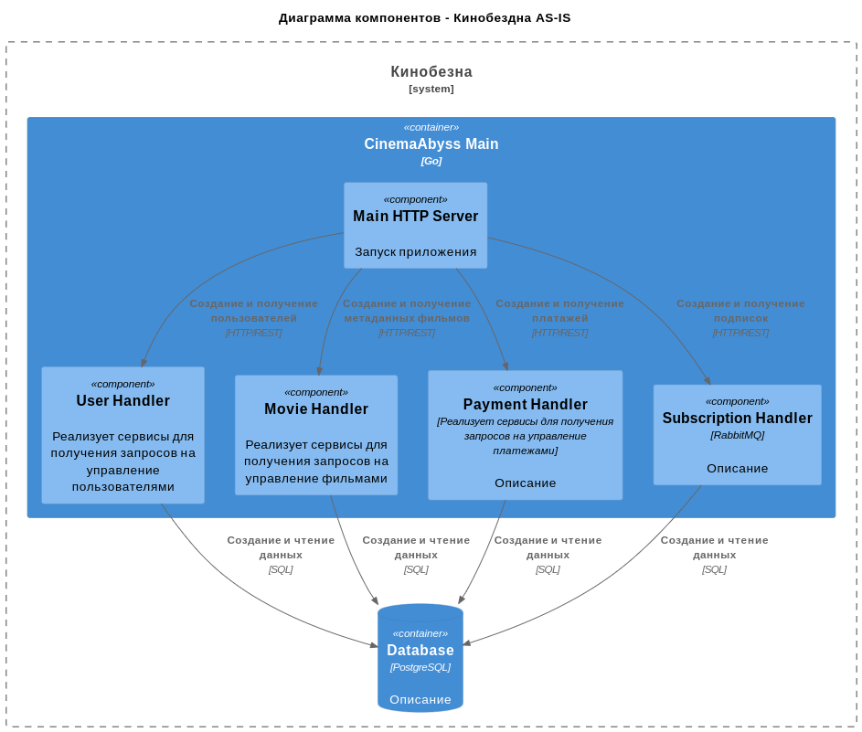

* **Main HTTP Server** - компонент запуска приложения.
* **User Handler**  - компонент, реализующий сервисы для получения запросов на управление пользователями, а именно:
  * Реализует входящий сервис getAllUsers для запроса списка всех пользователей `GET /api/users`.
  * Реализует входящий сервис getUserByID для запроса пользователя по его идентификатору `GET /api/users?id=:userId`.
  * Реализует входящий сервис createUser для создания пользователя `POST /api/users`.
* **Movie Handler** - компонент, реализующий сервисы для получения запросов на управление фильмами, а именно:
  * Реализует входящий сервис getAllMovies для запроса списка всех фильмов `GET /api/movies`.
  * Реализует входящий сервис getMovieByID для запроса фильма по его идентификатору `GET /api/movies?id=:movieId`.
  * Реализует входящий сервис createMovie для создания фильма `POST /api/movies`.
* **Payment Handler** - компонент, реализующий сервисы для получения запросов на управление платежами, а именно:
  * Реализует входящий сервис getAllPayments для запроса списка всех платеже `GET /api/payments`.
  * Реализует входящий сервис getPaymentByID для запроса платежа по его идентификатору `GET /api/payments?id=:paymentId`.
  * Реализует входящий сервис getPaymentsByUserID для запроса платежа по входящий идентификатору пользователя `GET /api/payments?id=:userId`.
  * Реализует входящий сервис createPayment для создания платежа `POST /api/payments`.
* **Subscription Handler** - компонент, реализующий сервисы для получения запросов на управление подписками, а именно:
  * Реализует входящий сервис getAllSubscriptions для запроса списка всех подписок `GET /api/subscriptions`.
  * Реализует входящий сервис getSubscriptionByID для запроса подписки по ее идентификатору `GET /api/subscriptions?id=:subscriptionId`.
  * Реализует входящий сервис getSubscriptionsByUserID для запроса подписки по идентификатору пользователя `GET /api/subscriptions?id=:userId`.
  * Реализует входящий сервис createSubscription для создания подписки `POST /api/subscriptions`.
* * **PostgreSQL Database** - компонент, отвечающий за базу данных.

## 1.4. Код монолитного приложения Кинобездна
> **Важно**: описание компонентов в данном разделе основывается на анализе текущего прилжоения в `src/monolith/`. Это необходимо для понимания работы приложеия и запуска соответствующих тестов.

Структуру кода можно посмотреть на диаграммме:

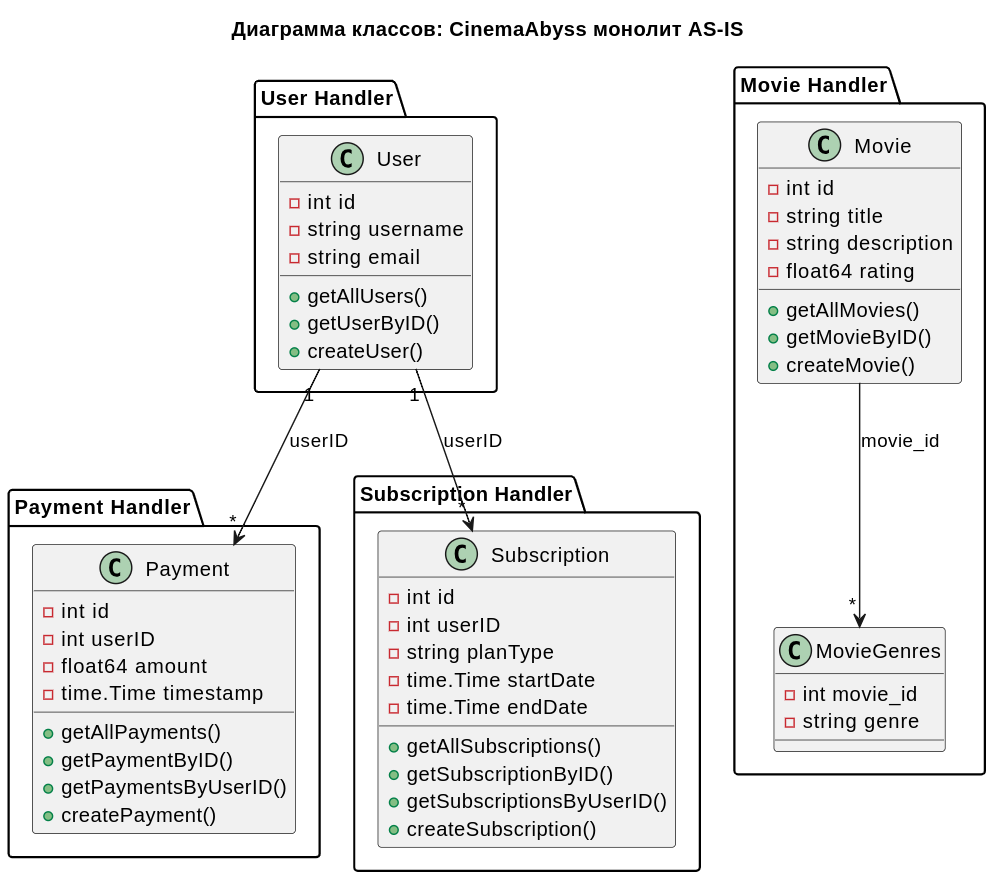.

## 1.5. Дополнительные компоненты

###  1.5.1. init.sql

Cкрипт для создания БД cinemaabyss. При запуске:

* Создает БД cinemaabyss.
* Создает таблицы users, movies, movie_genres, payments, subscriptions, views, user_ratings.
* Предзаполняет таблицы users, movies, movie_genres, payments, subscriptions, views, user_ratings.
* Создает иднексы в таблице.

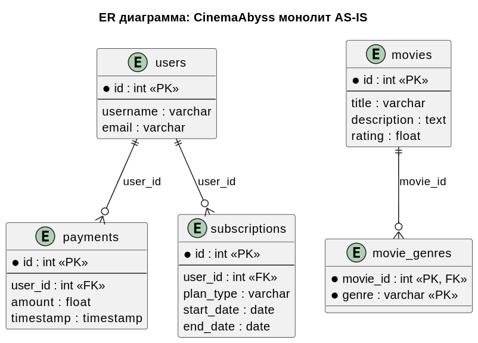

### 1.5.2. go.sum и go.mod
* **go.sum** - файл контроля целостности зависимостей.
* **go.mod** - файл декларации модуля.

### 1.5.3. Dockerfile

Файл создания Docker образа с приложением CinemaAbyss:

* Рабочая директория `/root`.
* Директория приложения `/app/monolith`.
* Порт `8080`.

# 2. Проектирование новой архитектуры приложения Кинобездна (TO-BE)

## 2.1. Стратегическое проектирование

В ходе стратегического проектирования были выделены следующие домены и контексты:

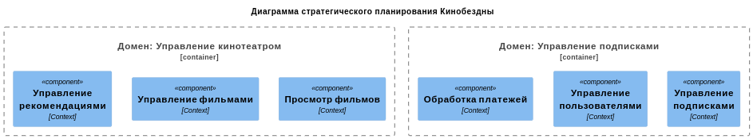

* **Домен: Управление кинотеатром**
  * Контекст: Управление рекомендациями - запрос рекомендаций, фильтрация рекоментаций, отображение рекомендаций и т.д (Recommendation Service).
  * Контекст: Управление фильмами - метаданные фильмов, рейтинги, жанры (Movies Service).
  * Контекст: Просмотр фильмов - онлайн кинотеатр, просмотр фильмов (Movies Online Service).
* **Домен: Управление подписками**
  * Контекст: Управление пользователями - регистрация, авторизация, роли, профили (Users Service).
  * Контекст: Управление подписками - подписки, скидки, тарифы и т.д (Subscription Service). 
  * Контекст: Обработка платежей - биллинг, история оплат, статусы, возвраты (Payments Service).

## 2.2. Тактическое проектирование

В ходе тактического проектирования на основе выделенных доменов и контекстов, а также существующей функциональности приложения Кинобездна построена диаграмма контейнеров:

**Диаграмма контейнера Proxy Service:**

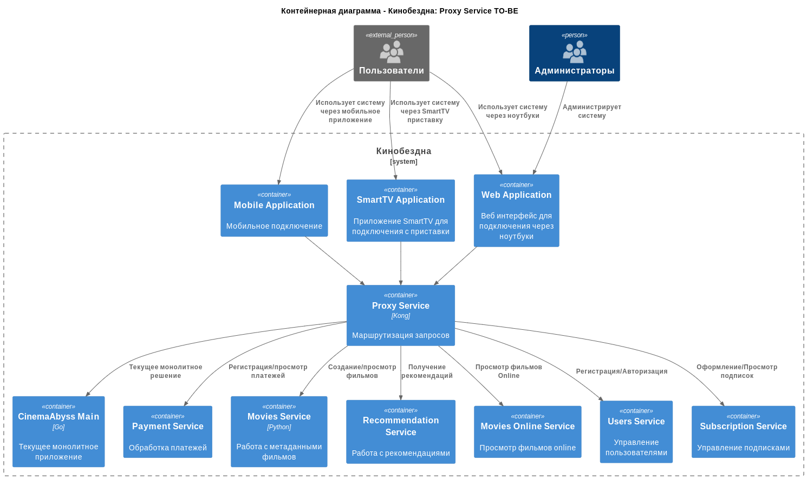

**Диаграмма контейнера CinemaAbyss Main:**

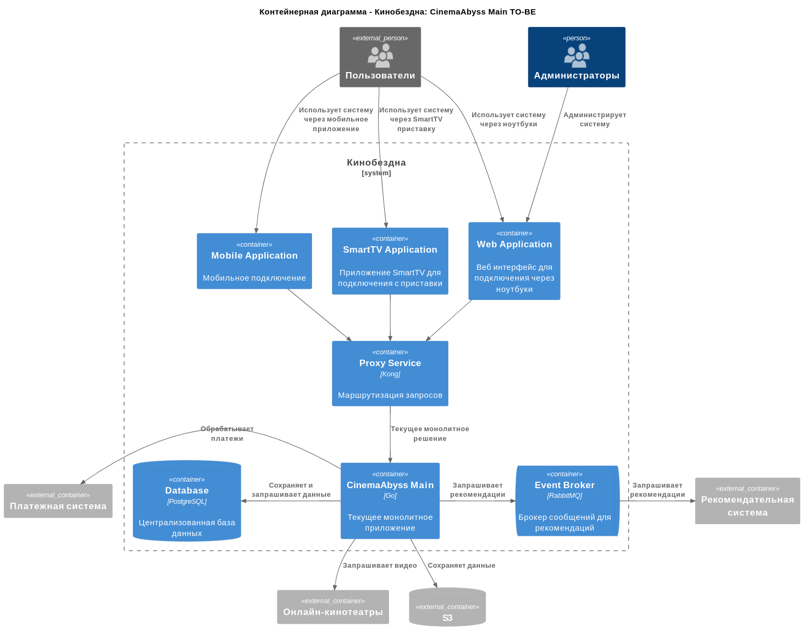

**Диаграмма контейнера Payment Service:**

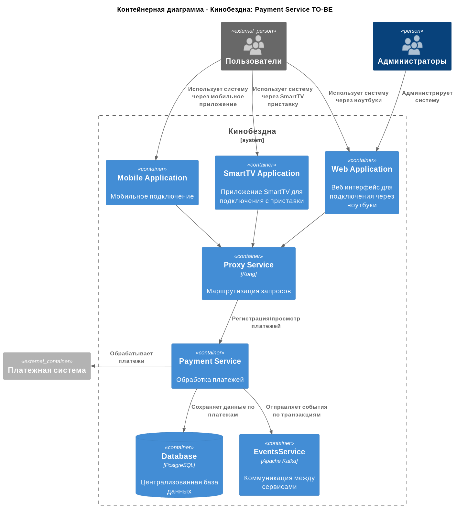

**Диаграмма контейнера Movies Service:**

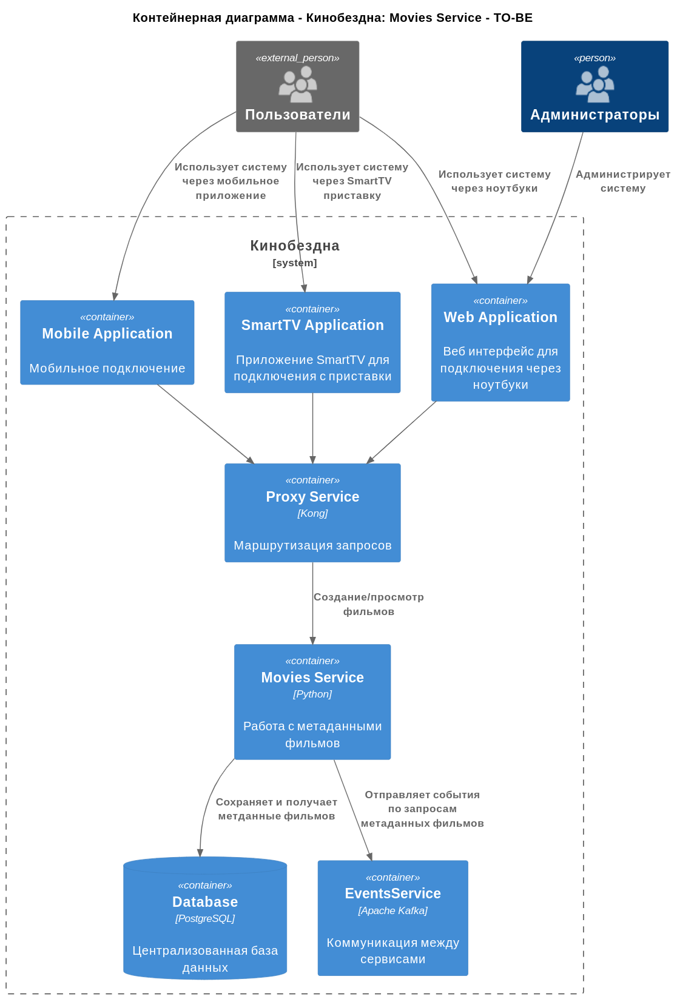

**Диаграмма контейнера Recommendation Service:**

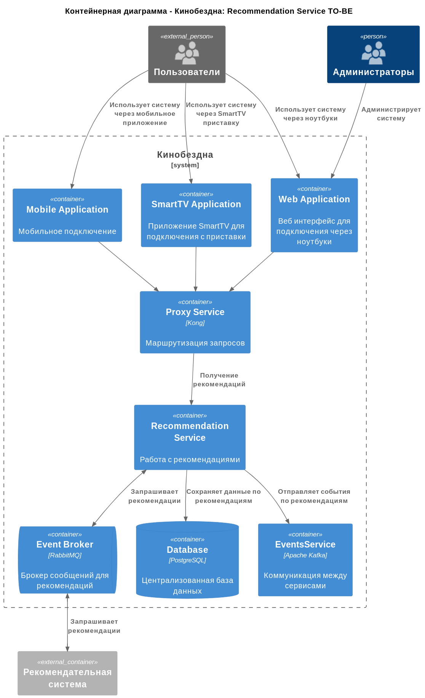

**Диаграмма контейнера Movies Online Service:**

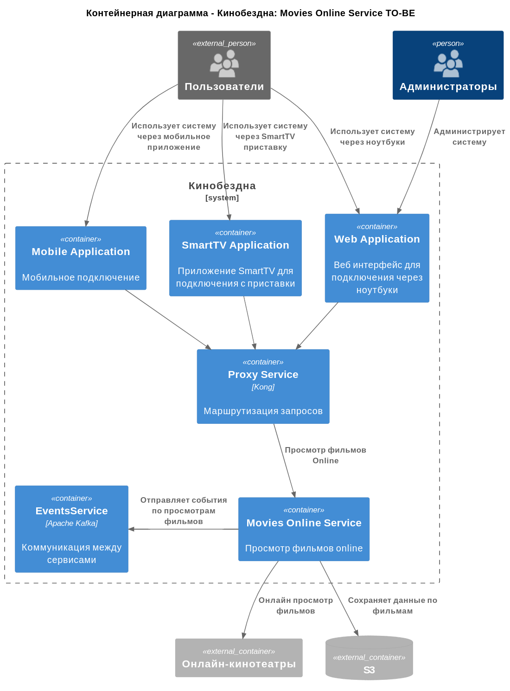

**Диаграмма контейнера Users Service:**

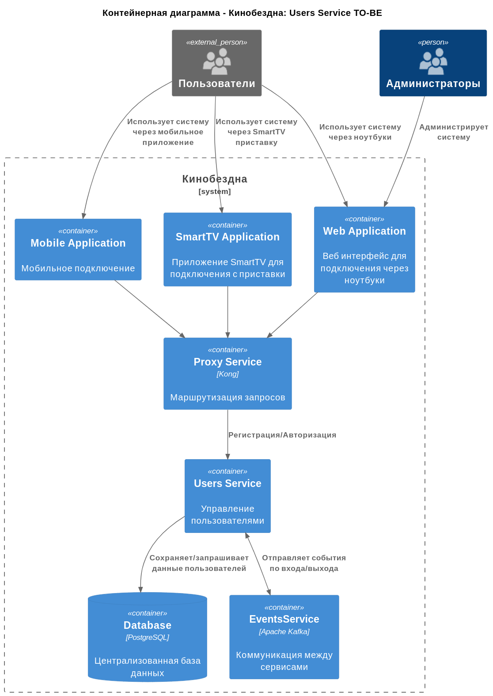

**Диаграмма контейнера Subscriotion Service:**

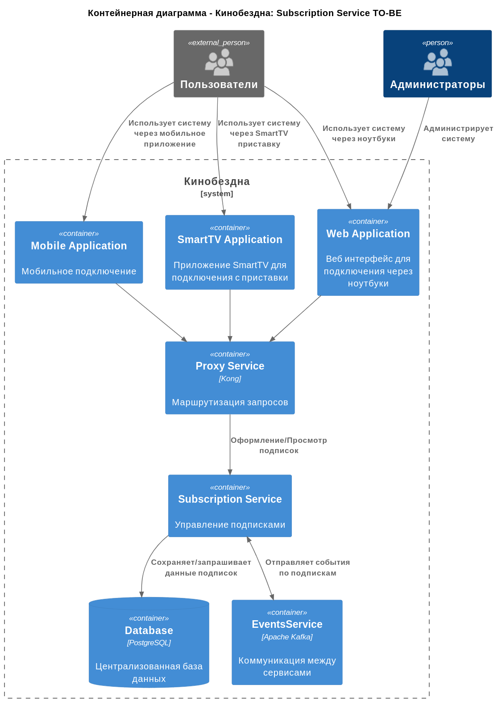
