## Изучите [README.md](.\README.md) файл и структуру проекта.

# Задание 1

1. Спроектируйте to be архитектуру КиноБездны, разделив всю систему на отдельные домены и организовав интеграционное взаимодействие и единую точку вызова сервисов.
Результат представьте в виде контейнерной диаграммы в нотации С4.
Добавьте ссылку на файл в этот шаблон
[CinemaAbyss_ArchDesign](./CinemaAbyss_ArchDesign.md)

## Результаты задания 1

Результаты анализа существующей архитектуры и проектирование to be архитектуры можно посмотреть в файле: [CinemaAbyss_ArchDesign](./CinemaAbyss_ArchDesign.md)


# Задание 2

## 1. Proxy
Команда КиноБездны уже выделила сервис метаданных о фильмах movies и вам необходимо реализовать бесшовный переход с применением паттерна Strangler Fig в части реализации прокси-сервиса (API Gateway), с помощью которого можно будет постепенно переключать траффик, используя фиче-флаг.


Реализуйте сервис на любом языке программирования в ./src/microservices/proxy.
Конфигурация для запуска сервиса через docker-compose уже добавлена
```yaml
  proxy-service:
    build:
      context: ./src/microservices/proxy
      dockerfile: Dockerfile
    container_name: cinemaabyss-proxy-service
    depends_on:
      - monolith
      - movies-service
      - events-service
    ports:
      - "8000:8000"
    environment:
      PORT: 8000
      MONOLITH_URL: http://monolith:8080
      #монолит
      MOVIES_SERVICE_URL: http://movies-service:8081 #сервис movies
      EVENTS_SERVICE_URL: http://events-service:8082 
      GRADUAL_MIGRATION: "true" # вкл/выкл простого фиче-флага
      MOVIES_MIGRATION_PERCENT: "50" # процент миграции
    networks:
      - cinemaabyss-network
```

- После реализации запустите postman тесты - они все должны быть зеленые (кроме events).
- Отправьте запросы к API Gateway:
   ```bash
   curl http://localhost:8000/api/movies
   ```
- Протестируйте постепенный переход, изменив переменную окружения MOVIES_MIGRATION_PERCENT в файле docker-compose.yml.

### Результаты задания 2.1

Для прокси был реализован не сервис-заглушки, а поднят KONG с настроенной маршрутизацией. Для этого:

1. Был создан файл: `./architecture-cinemaabyss/src/database/create-dbs.sql` для создания БД `cinemaabyss` и `kong` в одном контейнере.
2. Был создан файл: `./architecture-cinemaabyss/kong-init.sh` для добавления балансировки и маршрута
3. В `docker-compose.yaml` был изменен сервис postgres:
    1. Убрана инициализация БД `POSTGRES_DB: cinemaabyss`
    2. Добавлена ссылка на скрпит создания двух БД: `./src/database/create-dbs.sql:/docker-entrypoint-initdb.d/01-create-dbs.sql`
    3. Отредактирована ссылка создания БД `cinemaabyss`: `./src/database/init.sql:/docker-entrypoint-initdb.d/02-init.sql`
 4. В `docker-compose.yaml` был добавлен сервис `proxy-service-migrations` для инициализации БД Kong (поселе полной установки, контейнер можно удалить).
 5. В `docker-compose.yaml` был отрадактирован сервис `proxy-service` для установки Kong вместо сервиса-заглушки.
 6. В `docker-compose.yaml` был добавлен сервис `proxy-service-init` для создания балансировки и маршрутов Kong (поселе полной установки, контейнер можно удалить).
    1. Для http://monolith:8080 установлен weigth = 100.
    2. Для http://movies-service:8081 установлен weigth = 0 (чтобы автотесты проходили все. В сервисе movies-service отсутствут /api/users - будет выдавать ошибку, и отличается путь health - также будет выдавать ошибку).
    3. Для проверки балансировки можно выполнить команды: 
       1. `curl -X DELETE http://localhost:8001/upstreams/backend/targets/movies-service:8081`   - для удаления маршрута
       2. `curl -i -X POST http://localhost:8001/upstreams/backend/targets   --data target=movies-service:8081   --data weight=100`    - для изменения веса.
       3. После этого вызвать `curl --location 'http://localhost:8000/health'`   - работать будет через раз (когда обращение к http://monolith:8080 запрос будет успешный, а к http://movies-service:8081 неуспешный, так как путь будет не найден.)


### 2. Kafka
 Вам как архитектуру нужно также проверить гипотезу насколько просто реализовать применение Kafka в данной архитектуре.

Для этого нужно сделать MVP сервис events, который будет при вызове API создавать и сам же читать сообщения в топике Kafka.

    - Разработайте сервис на любом языке программирования с consumer'ами и producer'ами.
    - Реализуйте простой API, при вызове которого будут создаваться события User/Payment/Movie и обрабатываться внутри сервиса с записью в лог
    - Добавьте в docker-compose новый сервис, kafka там уже есть

Необходимые тесты для проверки этого API вызываются при запуске npm run test:local из папки tests/postman 
Приложите скриншот тестов и скриншот состояния топиков Kafka из UI http://localhost:8090 

### Результаты задания 2.2

В рамках задания 2.2 был реализован сервис events, который последовательно отправляет сообщения в топики и сразу их читает, записывая данное событие в журнал логов.

**Лог контейнера cinemaabyss-events-service после старта**

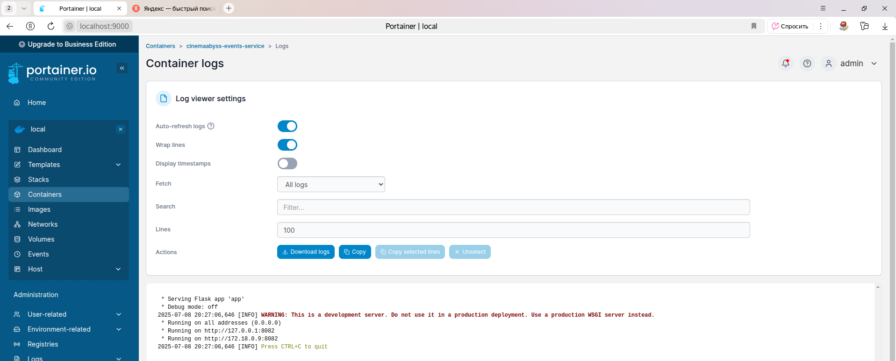

**Состояние кафки после старта**

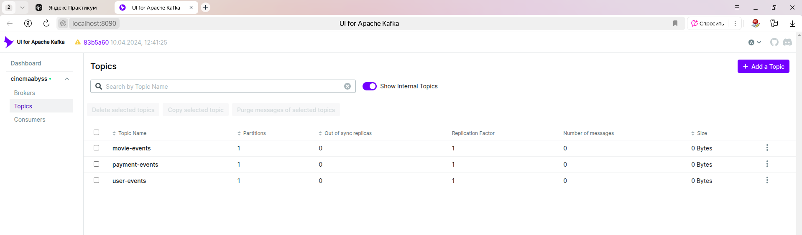

**Результаты тестов**

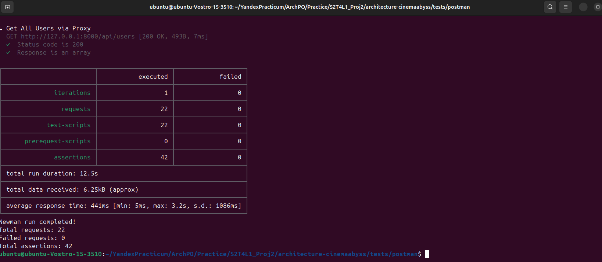

**Лог контейнера cinemaabyss-events-service после тестов**

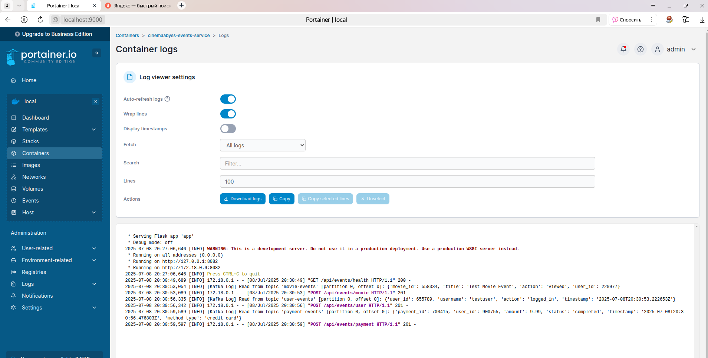

**Состояние кафки после тестов**

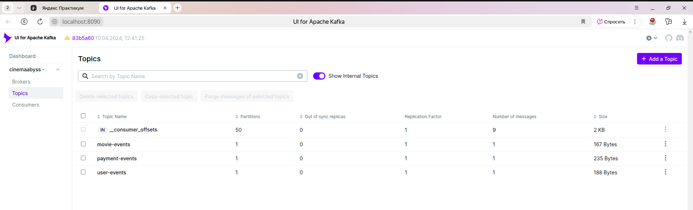

**Состояние топика movie-events после тестов**

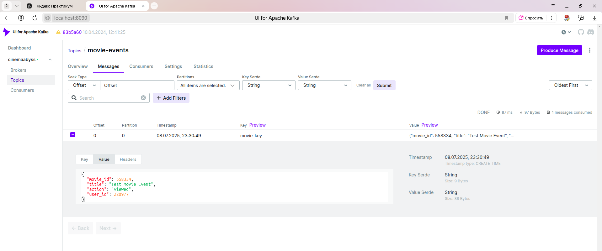

**Состояние топика user-events после тестов**

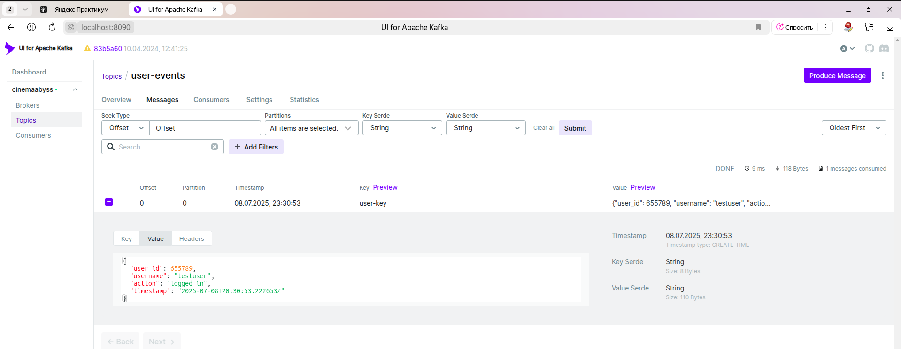

**Состояние топика paiments-events после тестов после тестов**

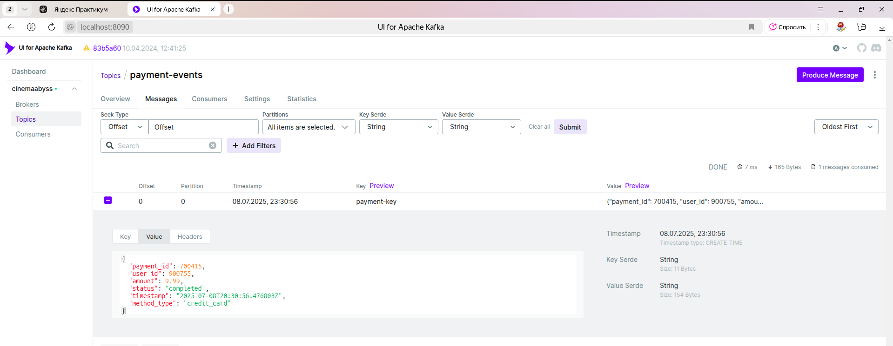

# Задание 3

Команда начала переезд в Kubernetes для лучшего масштабирования и повышения надежности. 
Вам, как архитектору осталось самое сложное:
 - реализовать CI/CD для сборки прокси сервиса
 - реализовать необходимые конфигурационные файлы для переключения трафика.


## CI/CD

 В папке .github/worflows доработайте деплой новых сервисов proxy и events в docker-build-push.yml , чтобы api-tests при сборке отрабатывали корректно при отправке коммита в ваш репозиторий.

Нужно доработать 
```yaml
on:
  push:
    branches: [ main ]
    paths:
      - 'src/**'
      - '.github/workflows/docker-build-push.yml'
  release:
    types: [published]
```
и добавить необходимые шаги в блок
```yaml
jobs:
  build-and-push:
    runs-on: ubuntu-latest
    permissions:
      contents: read
      packages: write

    steps:
      - name: Checkout repository
        uses: actions/checkout@v3

      - name: Set up Docker Buildx
        uses: docker/setup-buildx-action@v2

      - name: Log in to the Container registry
        uses: docker/login-action@v2
        with:
          registry: ${{ env.REGISTRY }}
          username: ${{ github.actor }}
          password: ${{ secrets.GITHUB_TOKEN }}

```
Как только сборка отработает и в github registry появятся ваши образы, можно переходить к блоку настройки Kubernetes
Успешным результатом данного шага является "зеленая" сборка и "зеленые" тесты

### Результаты задания 3.1.

В ходе задания были отребактированы скрипты workflow. При push отрабатывают автотесты и отправляются images в github registry.

**Результат workflow после commit**

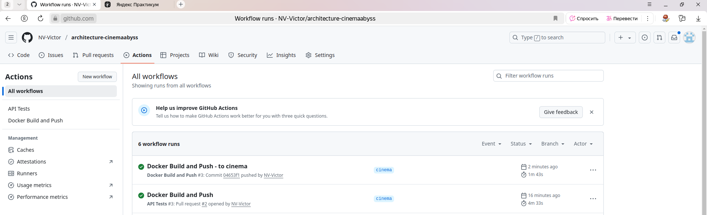

## Proxy в Kubernetes

### Шаг 1
Для деплоя в kubernetes необходимо залогиниться в docker registry Github'а.
1. Создайте Personal Access Token (PAT) https://github.com/settings/tokens . Создавайте class с правом read:packages
2. В src/kubernetes/*.yaml (event-service, monolith, movies-service и proxy-service)  отредактируйте путь до ваших образов 
```bash
 spec:
      containers:
      - name: events-service
        image: ghcr.io/ваш логин/имя репозитория/events-service:latest
```
3. Добавьте в секрет src/kubernetes/dockerconfigsecret.yaml в поле
```bash
 .dockerconfigjson: значение в base64 файла ~/.docker/config.json
```

4. Если в ~/.docker/config.json нет значения для аутентификации
```json
{
        "auths": {
                "ghcr.io": {
                       тут пусто
                }
        }
}
```
то выполните 

и добавьте

```json 
 "auth": "имя пользователя:токен в base64"
```

Чтобы получить значение в base64 можно выполнить команду
```bash
 echo -n ваш_логин:ваш_токен | base64
```

После заполнения config.json, также прогоните содержимое через base64

```bash
cat .docker/config.json | base64
```

и полученное значение добавляем в

```bash
 .dockerconfigjson: значение в base64 файла ~/.docker/config.json
```

### Шаг 2

  Доработайте src/kubernetes/event-service.yaml и src/kubernetes/proxy-service.yaml

  - Необходимо создать Deployment и Service 
  - Доработайте ingress.yaml, чтобы можно было с помощью тестов проверить создание событий
  - Выполните дальшейшие шаги для поднятия кластера:

  1. Создайте namespace:
  ```bash
  kubectl apply -f src/kubernetes/namespace.yaml
  ```
  2. Создайте секреты и переменные
  ```bash
  kubectl apply -f src/kubernetes/configmap.yaml
  kubectl apply -f src/kubernetes/secret.yaml
  kubectl apply -f src/kubernetes/dockerconfigsecret.yaml
  kubectl apply -f src/kubernetes/postgres-init-configmap.yaml
  kubectl apply -f src/kubernetes/proxy-service-init-configmap.yaml
  ```

  3. Разверните базу данных:
  ```bash
  kubectl apply -f src/kubernetes/postgres.yaml
  ```

  На этом этапе если вызвать команду
  ```bash
  kubectl -n cinemaabyss get pod
  ```
  Вы увидите

  NAME         READY   STATUS    
  postgres-0   1/1     Running   

  4. Разверните Kafka:
  ```bash
  kubectl apply -f src/kubernetes/kafka/kafka.yaml
  ```

  Проверьте, теперь должно быть запущено 3 пода, если что-то не так, то посмотрите логи
  ```bash
  kubectl -n cinemaabyss logs имя_пода (например - kafka-0)
  ```

  5. Разверните монолит:
  ```bash
  kubectl apply -f src/kubernetes/monolith.yaml
  ```
  6. Разверните микросервисы:
  ```bash
  kubectl apply -f src/kubernetes/movies-service.yaml
  kubectl apply -f src/kubernetes/events-service.yaml
  ```
  7. Разверните прокси-сервис:
  ```bash
  kubectl apply -f src/kubernetes/proxy-service.yaml
  ```

  После запуска и поднятия подов вывод команды 
  ```bash
  kubectl -n cinemaabyss get pod
  ```

  Будет наподобие такого

```bash
  NAME                              READY   STATUS    

  events-service-7587c6dfd5-6whzx   1/1     Running  

  kafka-0                           1/1     Running   

  monolith-8476598495-wmtmw         1/1     Running  

  movies-service-6d5697c584-4qfqs   1/1     Running  

  postgres-0                        1/1     Running  

  proxy-service-577d6c549b-6qfcv    1/1     Running  

  zookeeper-0                       1/1     Running 
```

  8. Добавим ingress

  - добавьте аддон
  ```bash
  minikube addons enable ingress
  ```
  ```bash
  kubectl apply -f src/kubernetes/ingress.yaml
  ```
  9. Добавьте в /etc/hosts
  127.0.0.1 cinemaabyss.example.com

  10. Вызовите
  ```bash
  minikube tunnel
  ```
  11. Вызовите https://cinemaabyss.example.com/api/movies
  Вы должны увидеть вывод списка фильмов
  Можно поэкспериментировать со значением   MOVIES_MIGRATION_PERCENT в src/kubernetes/configmap.yaml и убедится, что вызовы movies уходят полностью в новый сервис

  12. Запустите тесты из папки tests/postman
  ```bash
   npm run test:kubernetes
  ```
  Часть тестов с health-чек упадет, но создание событий отработает.
  Откройте логи event-service и сделайте скриншот обработки событий

### Шаг 3
Добавьте сюда скриншота вывода при вызове https://cinemaabyss.example.com/api/movies и  скриншот вывода event-service после вызова тестов.

### Результаты задания 3.2.

В результате выполнения задания 3.2 были произведены настройки деплоя сервисов в kubernetes. Результаты запуска сервиса events, kafka, а также прохождение автотестов преставлены в скриншотах ниже.

**Лог деплоя сервисов в kubernetes**

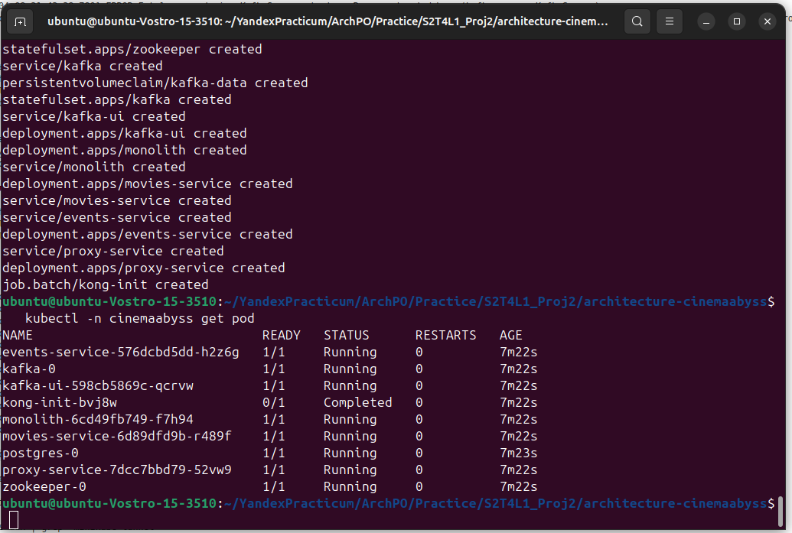

**Лог вызова сервиса event-service после старта**

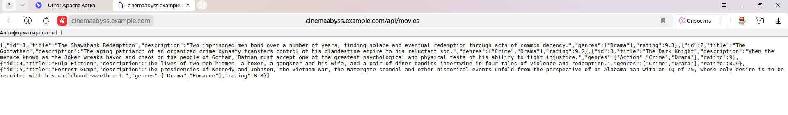

**Состояние кафки после старта**

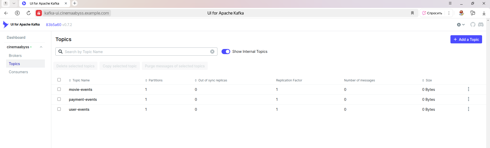

**Результаты тестов**

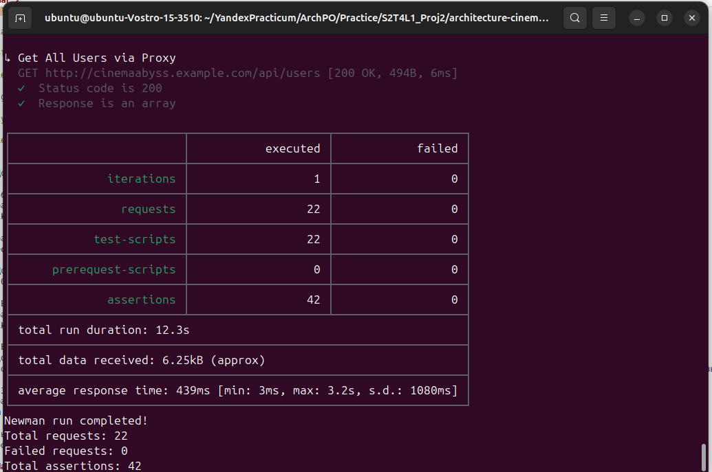

**Лог контейнера сервиса event-service после тестов**

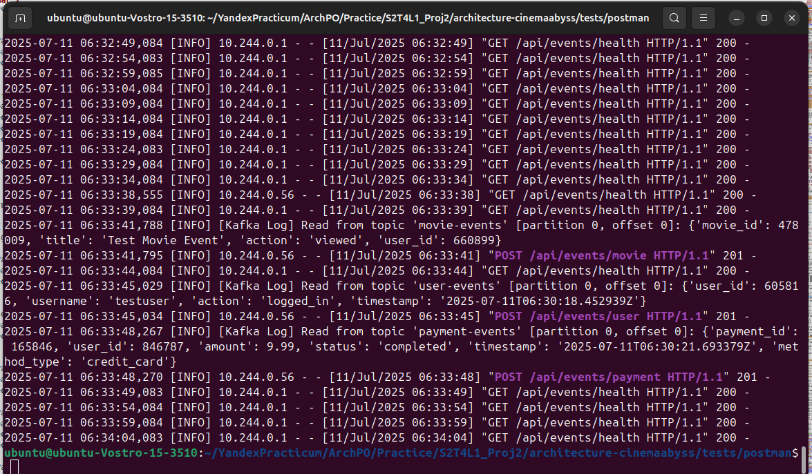

**Состояние кафки после тестов**

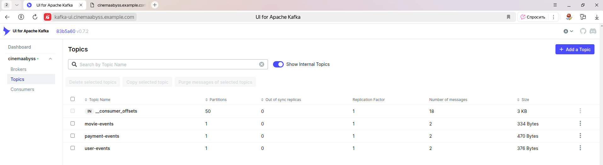

**Состояние топика movie-events после тестов**

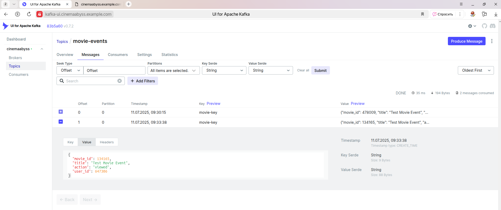

**Состояние топика user-events после тестов**

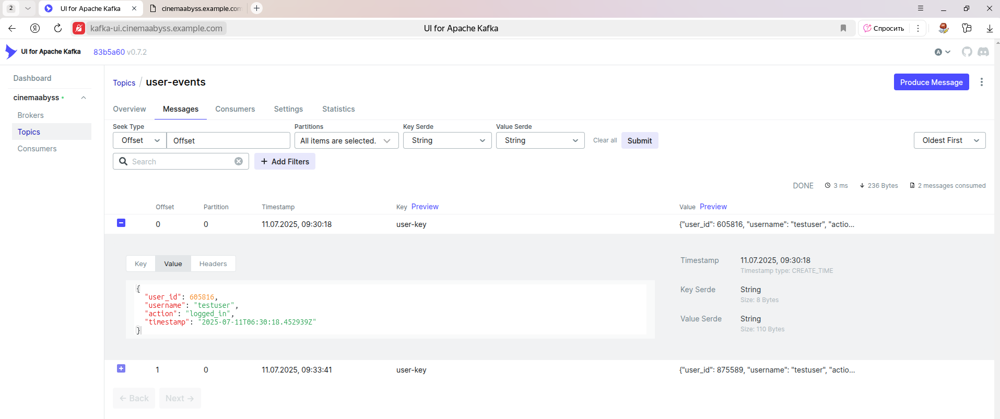

**Состояние топика paiments-events после тестов после тестов**

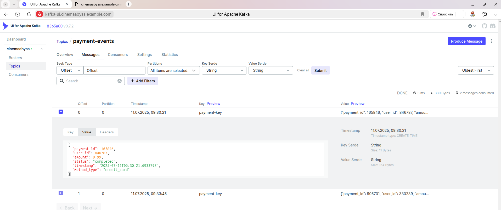

# Задание 4
Для простоты дальнейшего обновления и развертывания вам как архитектуру необходимо так же реализовать helm-чарты для прокси-сервиса и проверить работу 

Для этого:
1. Перейдите в директорию helm и отредактируйте файл values.yaml

```yaml
# Proxy service configuration
proxyService:
  enabled: true
  image:
    repository: ghcr.io/db-exp/cinemaabysstest/proxy-service
    tag: latest
    pullPolicy: Always
  replicas: 1
  resources:
    limits:
      cpu: 300m
      memory: 256Mi
    requests:
      cpu: 100m
      memory: 128Mi
  service:
    port: 80
    targetPort: 8000
    type: ClusterIP
```

- Вместо ghcr.io/db-exp/cinemaabysstest/proxy-service напишите свой путь до образа для всех сервисов
- для imagePullSecret проставьте свое значение (скопируйте из конфигурации kubernetes)
  ```yaml
  imagePullSecrets:
      dockerconfigjson: ewoJImF1dGhzIjogewoJCSJnaGNyLmlvIjogewoJCQkiYXV0aCI6ICJaR0l0Wlhod09tZG9jRjl2UTJocVZIa3dhMWhKVDIxWmFVZHJOV2hRUW10aFVXbFZSbTVaTjJRMFNYUjRZMWM9IgoJCX0KCX0sCgkiY3JlZHNTdG9yZSI6ICJkZXNrdG9wIiwKCSJjdXJyZW50Q29udGV4dCI6ICJkZXNrdG9wLWxpbnV4IiwKCSJwbHVnaW5zIjogewoJCSIteC1jbGktaGludHMiOiB7CgkJCSJlbmFibGVkIjogInRydWUiCgkJfQoJfSwKCSJmZWF0dXJlcyI6IHsKCQkiaG9va3MiOiAidHJ1ZSIKCX0KfQ==
  ```

2. В папке ./templates/services заполните шаблоны для proxy-service.yaml и events-service.yaml (опирайтесь на свою kubernetes конфигурацию - смысл helm'а сделать шаблоны для быстрого обновления и установки)

```yaml
template:
    metadata:
      labels:
        app: proxy-service
    spec:
      containers:
       Тут ваша конфигурация
```

3. Проверьте установку
Сначала удалим установку руками

```bash
kubectl delete all --all -n cinemaabyss
kubectl delete  namespace cinemaabyss
```
Запустите 
```bash
helm install cinemaabyss ./src/kubernetes/helm --namespace cinemaabyss --create-namespace
```
Если в процессе будет ошибка
```code
[2025-04-08 21:43:38,780] ERROR Fatal error during KafkaServer startup. Prepare to shutdown (kafka.server.KafkaServer)
kafka.common.InconsistentClusterIdException: The Cluster ID OkOjGPrdRimp8nkFohYkCw doesn't match stored clusterId Some(sbkcoiSiQV2h_mQpwy05zQ) in meta.properties. The broker is trying to join the wrong cluster. Configured zookeeper.connect may be wrong.
```

Проверьте развертывание:
```bash
kubectl get pods -n cinemaabyss
minikube tunnel
```

Потом вызовите 
https://cinemaabyss.example.com/api/movies
и приложите скриншот развертывания helm и вывода https://cinemaabyss.example.com/api/movies

## Удаляем все

```bash
kubectl delete all --all -n cinemaabyss
kubectl delete namespace cinemaabyss
```

## Результаты задания 4.

В процессе выполнения задания 4 были настроены шаблоны и конфигурационных параметров helm. Результат запуска help и выполнение автотестов указан ниже.

**Результат запуска helm**

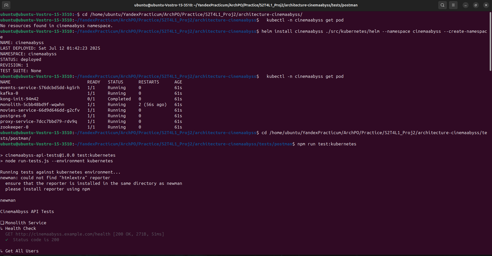


```bash
ubuntu@ubuntu-Vostro-15-3510:~$ cd /home/ubuntu/YandexPracticum/ArchPO/Practice/S2T4L1_Proj2/architecture-cinemaabyss/
ubuntu@ubuntu-Vostro-15-3510:~/YandexPracticum/ArchPO/Practice/S2T4L1_Proj2/architecture-cinemaabyss$   kubectl -n cinemaabyss get pod
No resources found in cinemaabyss namespace.
ubuntu@ubuntu-Vostro-15-3510:~/YandexPracticum/ArchPO/Practice/S2T4L1_Proj2/architecture-cinemaabyss$ helm install cinemaabyss ./src/kubernetes/helm --namespace cinemaabyss --create-namespace
NAME: cinemaabyss
LAST DEPLOYED: Sat Jul 12 01:42:23 2025
NAMESPACE: cinemaabyss
STATUS: deployed
REVISION: 1
TEST SUITE: None
ubuntu@ubuntu-Vostro-15-3510:~/YandexPracticum/ArchPO/Practice/S2T4L1_Proj2/architecture-cinemaabyss$   kubectl -n cinemaabyss get pod
NAME                              READY   STATUS      RESTARTS      AGE
events-service-576dcbd5dd-kg5rh   1/1     Running     0             61s
kafka-0                           1/1     Running     0             61s
kong-init-94m42                   0/1     Completed   0             61s
monolith-5cbb48bd9f-wqwhn         1/1     Running     2 (56s ago)   61s
movies-service-66d9d646dd-g2cfv   1/1     Running     0             61s
postgres-0                        1/1     Running     0             61s
proxy-service-7dcc7bbd79-rdv9q    1/1     Running     0             61s
zookeeper-0                       1/1     Running     0             61s
ubuntu@ubuntu-Vostro-15-3510:~/YandexPracticum/ArchPO/Practice/S2T4L1_Proj2/architecture-cinemaabyss$ cd /home/ubuntu/YandexPracticum/ArchPO/Practice/S2T4L1_Proj2/architecture-cinemaabyss/tests/postman/
ubuntu@ubuntu-Vostro-15-3510:~/YandexPracticum/ArchPO/Practice/S2T4L1_Proj2/architecture-cinemaabyss/tests/postman$ npm run test:kubernetes

> cinemaabyss-api-tests@1.0.0 test:kubernetes
> node run-tests.js --environment kubernetes

Running tests against kubernetes environment...
newman: could not find "htmlextra" reporter
  ensure that the reporter is installed in the same directory as newman
  please install reporter using npm

newman

CinemaAbyss API Tests

❏ Monolith Service
↳ Health Check
  GET http://cinemaabyss.example.com/health [200 OK, 271B, 51ms]
  ✓  Status code is 200

↳ Get All Users
  GET http://cinemaabyss.example.com/api/users [200 OK, 426B, 11ms]
  ✓  Status code is 200
  ✓  Response is an array

↳ Create User
  POST http://cinemaabyss.example.com/api/users [201 Created, 328B, 13ms]
  ✓  Status code is 201
  ✓  Response has id

↳ Get User by ID
  GET http://cinemaabyss.example.com/api/users?id=4 [200 OK, 323B, 8ms]
  ✓  Status code is 200
  ✓  User ID matches

↳ Get All Movies
  GET http://cinemaabyss.example.com/api/movies [200 OK, 1.53kB, 20ms]
  ✓  Status code is 200
  ✓  Response is an array

↳ Create Movie
  POST http://cinemaabyss.example.com/api/movies [201 Created, 392B, 13ms]
  ✓  Status code is 201
  ✓  Response has id

↳ Get Movie by ID
  GET http://cinemaabyss.example.com/api/movies?id=6 [200 OK, 387B, 8ms]
  ✓  Status code is 200
  ✓  Movie ID matches

↳ Create Payment
  POST http://cinemaabyss.example.com/api/payments [201 Created, 340B, 16ms]
  ✓  Status code is 201
  ✓  Response has id

↳ Get Payment by ID
  GET http://cinemaabyss.example.com/api/payments?id=4 [200 OK, 332B, 9ms]
  ✓  Status code is 200
  ✓  Payment ID matches

↳ Create Subscription
  POST http://cinemaabyss.example.com/api/subscriptions [201 Created, 382B, 14ms]
  ✓  Status code is 201
  ✓  Response has id

↳ Get Subscription by ID
  GET http://cinemaabyss.example.com/api/subscriptions?id=4 [200 OK, 377B, 8ms]
  ✓  Status code is 200
  ✓  Subscription ID matches

❏ Movies Microservice
↳ Health Check
  GET http://cinemaabyss.example.com/api/movies/health [200 OK, 148B, 5ms]
  ✓  Status code is 200
  ✓  Status is true

↳ Get All Movies
  GET http://cinemaabyss.example.com/api/movies [200 OK, 1.66kB, 11ms]
  ✓  Status code is 200
  ✓  Response is an array

↳ Create Movie
  POST http://cinemaabyss.example.com/api/movies [201 Created, 428B, 15ms]
  ✓  Status code is 201
  ✓  Response has id

↳ Get Movie by ID
  GET http://cinemaabyss.example.com/api/movies?id=7 [200 OK, 423B, 7ms]
  ✓  Status code is 200
  ✓  Movie ID matches

❏ Events Microservice
↳ Health Check
  GET http://cinemaabyss.example.com/api/events/health [200 OK, 148B, 7ms]
  ✓  Status code is 200
  ✓  Status is true

↳ Create Movie Event
  POST http://cinemaabyss.example.com/api/events/movie [201 CREATED, 249B, 3.4s]
  ✓  Status code is 201
  ✓  Response has status success

↳ Create User Event
  POST http://cinemaabyss.example.com/api/events/user [201 CREATED, 271B, 3.1s]
  ✓  Status code is 201
  ✓  Response has status success

↳ Create Payment Event
  POST http://cinemaabyss.example.com/api/events/payment [201 CREATED, 311B, 3.1s]
  ✓  Status code is 201
  ✓  Response has status success

❏ Proxy Service
↳ Health Check
  GET http://cinemaabyss.example.com/health [200 OK, 271B, 6ms]
  ✓  Status code is 200

↳ Get All Movies via Proxy
  GET http://cinemaabyss.example.com/api/movies [200 OK, 1.82kB, 9ms]
  ✓  Status code is 200
  ✓  Response is an array

↳ Get All Users via Proxy
  GET http://cinemaabyss.example.com/api/users [200 OK, 494B, 6ms]
  ✓  Status code is 200
  ✓  Response is an array

┌─────────────────────────┬────────────────────┬───────────────────┐
│                         │           executed │            failed │
├─────────────────────────┼────────────────────┼───────────────────┤
│              iterations │                  1 │                 0 │
├─────────────────────────┼────────────────────┼───────────────────┤
│                requests │                 22 │                 0 │
├─────────────────────────┼────────────────────┼───────────────────┤
│            test-scripts │                 22 │                 0 │
├─────────────────────────┼────────────────────┼───────────────────┤
│      prerequest-scripts │                  0 │                 0 │
├─────────────────────────┼────────────────────┼───────────────────┤
│              assertions │                 42 │                 0 │
├─────────────────────────┴────────────────────┴───────────────────┤
│ total run duration: 12.7s                                        │
├──────────────────────────────────────────────────────────────────┤
│ total data received: 6.25kB (approx)                             │
├──────────────────────────────────────────────────────────────────┤
│ average response time: 450ms [min: 5ms, max: 3.4s, s.d.: 1104ms] │
└──────────────────────────────────────────────────────────────────┘
Newman run completed!
Total requests: 22
Failed requests: 0
Total assertions: 42
Failed assertions: 0
```